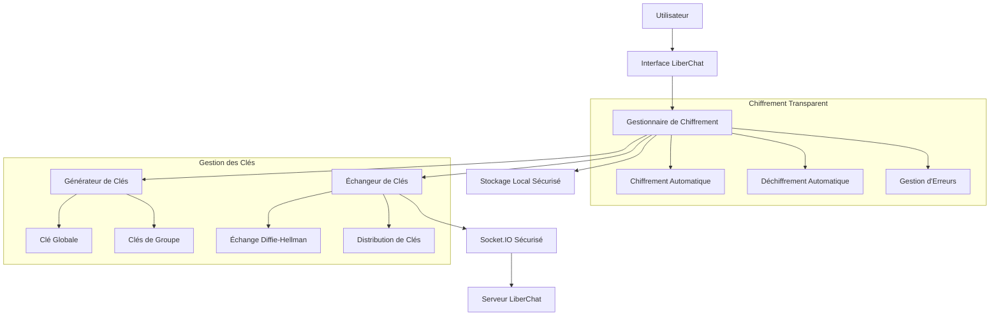

# Design Document - Chiffrement Automatique Transparent

## Overview

Le système actuel de LiberChat utilise déjà un chiffrement AES-GCM avec une clé symétrique générée automatiquement. Cependant, il semble y avoir une interface utilisateur qui demande une "clé de chiffrement partagée" qui crée de la friction. Ce design vise à :

1. **Éliminer complètement** toute demande de clé ou mot de passe à l'utilisateur
2. **Améliorer la gestion des clés** pour les groupes avec un système d'échange sécurisé
3. **Maintenir la sécurité** tout en rendant le chiffrement complètement transparent
4. **Implémenter des indicateurs visuels** discrets pour confirmer la sécurité

## Architecture

### Vue d'ensemble du système



### Architecture en couches

```
┌─────────────────────────────────────────┐
│           Interface Utilisateur          │ ← Aucune friction crypto
├─────────────────────────────────────────┤
│        Couche de Chiffrement            │ ← Transparent et automatique
├─────────────────────────────────────────┤
│         Gestion des Clés                │ ← Génération et échange auto
├─────────────────────────────────────────┤
│        Stockage Sécurisé                │ ← localStorage chiffré
├─────────────────────────────────────────┤
│         Communication                   │ ← Socket.IO + WebRTC
└─────────────────────────────────────────┘
```

## Components and Interfaces

### 1. CryptoManager (Nouveau composant central)

```typescript
interface CryptoManager {
  // Gestion des clés
  generateGlobalKey(): Promise<CryptoKey>;
  generateGroupKey(groupId: string): Promise<CryptoKey>;
  getKey(context: 'global' | string): Promise<CryptoKey | null>;
  storeKey(context: string, key: CryptoKey): Promise<void>;
  
  // Chiffrement/Déchiffrement
  encryptMessage(message: string, context?: string): Promise<EncryptedMessage>;
  decryptMessage(encrypted: EncryptedMessage, context?: string): Promise<string>;
  
  // Échange de clés
  initiateKeyExchange(groupId: string): Promise<void>;
  handleKeyExchange(data: KeyExchangeData): Promise<void>;
  
  // Gestion d'erreurs
  handleDecryptionError(error: Error, context: string): Promise<void>;
  regenerateKey(context: string): Promise<void>;
}
```

### 2. SecureStorage (Stockage local sécurisé)

```typescript
interface SecureStorage {
  // Stockage des clés
  storeKey(keyId: string, key: CryptoKey): Promise<void>;
  retrieveKey(keyId: string): Promise<CryptoKey | null>;
  deleteKey(keyId: string): Promise<void>;
  listKeys(): Promise<string[]>;
  
  // Métadonnées
  storeMetadata(keyId: string, metadata: KeyMetadata): Promise<void>;
  getMetadata(keyId: string): Promise<KeyMetadata | null>;
  
  // Nettoyage
  cleanup(): Promise<void>;
  exportKeys(): Promise<ExportedKeys>;
  importKeys(keys: ExportedKeys): Promise<void>;
}
```

### 3. KeyExchanger (Échange de clés pour groupes)

```typescript
interface KeyExchanger {
  // Protocole d'échange
  generateKeyPair(): Promise<CryptoKeyPair>;
  deriveSharedSecret(publicKey: CryptoKey, privateKey: CryptoKey): Promise<CryptoKey>;
  
  // Gestion des groupes
  joinGroup(groupId: string): Promise<void>;
  leaveGroup(groupId: string): Promise<void>;
  rotateGroupKey(groupId: string): Promise<void>;
  
  // Sécurité
  verifyPeer(peerId: string, signature: ArrayBuffer): Promise<boolean>;
  signMessage(message: ArrayBuffer): Promise<ArrayBuffer>;
}
```

### 4. EncryptionIndicator (Indicateurs visuels)

```typescript
interface EncryptionIndicator {
  // États de chiffrement
  showEncrypted(element: HTMLElement): void;
  showDecrypting(element: HTMLElement): void;
  showError(element: HTMLElement, error: string): void;
  showUnsecured(element: HTMLElement): void;
  
  // Indicateurs de groupe
  updateGroupStatus(groupId: string, status: SecurityStatus): void;
  showKeyExchange(groupId: string): void;
  
  // Notifications
  notifyKeyRotation(context: string): void;
  notifySecurityUpgrade(): void;
}
```

## Data Models

### EncryptedMessage

```typescript
interface EncryptedMessage {
  iv: number[];           // Vecteur d'initialisation
  content: number[];      // Contenu chiffré
  algorithm: string;      // 'AES-GCM'
  keyVersion: number;     // Version de la clé utilisée
  timestamp: number;      // Horodatage du chiffrement
  context?: string;       // Contexte (groupe, global)
}
```

### KeyMetadata

```typescript
interface KeyMetadata {
  id: string;             // Identifiant unique de la clé
  context: string;        // 'global' ou groupId
  algorithm: string;      // 'AES-GCM'
  length: number;         // 256
  created: number;        // Timestamp de création
  lastUsed: number;       // Dernière utilisation
  version: number;        // Version de la clé
  rotationSchedule?: number; // Prochaine rotation
}
```

### SecurityStatus

```typescript
interface SecurityStatus {
  encrypted: boolean;     // Messages chiffrés
  keyExchanged: boolean;  // Clés échangées avec succès
  peersVerified: number;  // Nombre de pairs vérifiés
  lastKeyRotation: number; // Dernière rotation
  algorithm: string;      // Algorithme utilisé
  strength: 'weak' | 'medium' | 'strong'; // Force de sécurité
}
```

## Error Handling

### Stratégie de gestion d'erreurs en cascade

```typescript
class CryptoErrorHandler {
  async handleError(error: CryptoError, context: string): Promise<void> {
    switch (error.type) {
      case 'DECRYPTION_FAILED':
        await this.handleDecryptionFailure(error, context);
        break;
      case 'KEY_NOT_FOUND':
        await this.handleMissingKey(error, context);
        break;
      case 'KEY_EXCHANGE_FAILED':
        await this.handleKeyExchangeFailure(error, context);
        break;
      case 'STORAGE_ERROR':
        await this.handleStorageError(error, context);
        break;
      default:
        await this.handleGenericError(error, context);
    }
  }
  
  private async handleDecryptionFailure(error: CryptoError, context: string) {
    // 1. Essayer avec une clé de sauvegarde
    // 2. Demander une resynchronisation
    // 3. Régénérer la clé si nécessaire
    // 4. Mode dégradé en dernier recours
  }
}
```

### Modes de récupération

1. **Récupération automatique** : Régénération de clé transparente
2. **Resynchronisation** : Échange de clés avec les pairs
3. **Mode dégradé** : Fonctionnement sans chiffrement (avec avertissement)
4. **Récupération manuelle** : Interface simple pour l'utilisateur

## Testing Strategy

### Tests unitaires

```typescript
describe('CryptoManager', () => {
  test('génère une clé globale automatiquement', async () => {
    const crypto = new CryptoManager();
    const key = await crypto.generateGlobalKey();
    expect(key).toBeDefined();
    expect(key.algorithm.name).toBe('AES-GCM');
  });
  
  test('chiffre et déchiffre un message', async () => {
    const crypto = new CryptoManager();
    const message = 'Message secret';
    const encrypted = await crypto.encryptMessage(message);
    const decrypted = await crypto.decryptMessage(encrypted);
    expect(decrypted).toBe(message);
  });
  
  test('gère les erreurs de déchiffrement gracieusement', async () => {
    const crypto = new CryptoManager();
    const corruptedMessage = { iv: [], content: [], algorithm: 'AES-GCM' };
    await expect(crypto.decryptMessage(corruptedMessage)).resolves.not.toThrow();
  });
});
```

### Tests d'intégration

```typescript
describe('Intégration Chiffrement-Interface', () => {
  test('envoie un message chiffré sans intervention utilisateur', async () => {
    const app = render(<App />);
    const input = screen.getByPlaceholderText('Tapez votre message...');
    
    fireEvent.change(input, { target: { value: 'Message test' } });
    fireEvent.click(screen.getByText('Envoyer'));
    
    // Vérifier que le message est chiffré automatiquement
    expect(mockSocket.emit).toHaveBeenCalledWith('chat message', 
      expect.objectContaining({
        content: expect.stringMatching(/^{"iv":\[.*\],"content":\[.*\]}$/)
      })
    );
  });
});
```

### Tests de sécurité

```typescript
describe('Sécurité du chiffrement', () => {
  test('utilise des IV uniques pour chaque message', async () => {
    const crypto = new CryptoManager();
    const message = 'Message identique';
    
    const encrypted1 = await crypto.encryptMessage(message);
    const encrypted2 = await crypto.encryptMessage(message);
    
    expect(encrypted1.iv).not.toEqual(encrypted2.iv);
    expect(encrypted1.content).not.toEqual(encrypted2.content);
  });
  
  test('ne stocke jamais les clés en clair', async () => {
    const storage = new SecureStorage();
    const key = await crypto.subtle.generateKey(
      { name: 'AES-GCM', length: 256 }, true, ['encrypt', 'decrypt']
    );
    
    await storage.storeKey('test', key);
    
    // Vérifier que localStorage ne contient pas de clé en clair
    const stored = localStorage.getItem('crypto_key_test');
    expect(stored).not.toContain('-----BEGIN');
    expect(stored).not.toMatch(/^[A-Za-z0-9+/]+=*$/); // Base64
  });
});
```

## Implementation Plan

### Phase 1 : Suppression de l'interface de clé

1. **Identifier et supprimer** tous les champs de saisie de clé de chiffrement
2. **Modifier WelcomeScreen** pour éliminer toute référence aux clés
3. **Mettre à jour les composants** pour utiliser le chiffrement automatique
4. **Tests de régression** pour s'assurer que rien n'est cassé

### Phase 2 : Amélioration du CryptoManager

1. **Créer le CryptoManager centralisé** avec toutes les fonctionnalités
2. **Implémenter SecureStorage** pour le stockage local sécurisé
3. **Ajouter la gestion d'erreurs** avec récupération automatique
4. **Intégrer dans App.tsx** en remplacement du système actuel

### Phase 3 : Système d'échange de clés pour groupes

1. **Implémenter KeyExchanger** avec protocole Diffie-Hellman
2. **Modifier GroupChat** pour utiliser les clés de groupe
3. **Ajouter la rotation automatique** des clés de groupe
4. **Tests de sécurité** pour l'échange de clés

### Phase 4 : Indicateurs visuels et UX

1. **Créer EncryptionIndicator** avec icônes discrètes
2. **Ajouter aux composants de message** les indicateurs de sécurité
3. **Implémenter les notifications** pour les événements crypto
4. **Tests d'accessibilité** pour les indicateurs

### Phase 5 : Mode dégradé et récupération

1. **Implémenter le mode dégradé** pour les cas d'erreur
2. **Ajouter les options de récupération** dans les paramètres
3. **Créer l'interface de diagnostic** pour les utilisateurs avancés
4. **Tests de résilience** et de récupération

## Security Considerations

### Génération de clés sécurisée

- Utilisation de `crypto.getRandomValues()` pour l'entropie
- Clés AES-GCM 256 bits minimum
- Rotation automatique des clés de groupe
- Vérification de l'intégrité des clés stockées

### Stockage sécurisé

- Chiffrement des clés avant stockage dans localStorage
- Utilisation d'une clé maître dérivée du contexte navigateur
- Nettoyage automatique des clés expirées
- Protection contre l'extraction par des scripts malveillants

### Échange de clés

- Protocole Diffie-Hellman Curve25519
- Vérification de l'authenticité des pairs
- Protection contre les attaques man-in-the-middle
- Rotation régulière des clés de groupe

### Résilience

- Mode dégradé avec avertissements clairs
- Récupération automatique en cas d'erreur
- Logs de sécurité pour audit
- Interface de diagnostic pour le dépannage

## Performance Considerations

### Optimisations

- Cache des clés en mémoire pour éviter les accès répétés au storage
- Chiffrement asynchrone pour ne pas bloquer l'interface
- Pré-génération des clés de groupe
- Compression des messages avant chiffrement

### Métriques

- Temps de chiffrement/déchiffrement < 100ms
- Taille des messages chiffrés < 150% de l'original
- Temps d'échange de clés < 2 secondes
- Utilisation mémoire < 10MB pour les clés

Cette architecture garantit un chiffrement transparent et sécurisé tout en éliminant complètement la friction utilisateur liée aux clés de chiffrement.